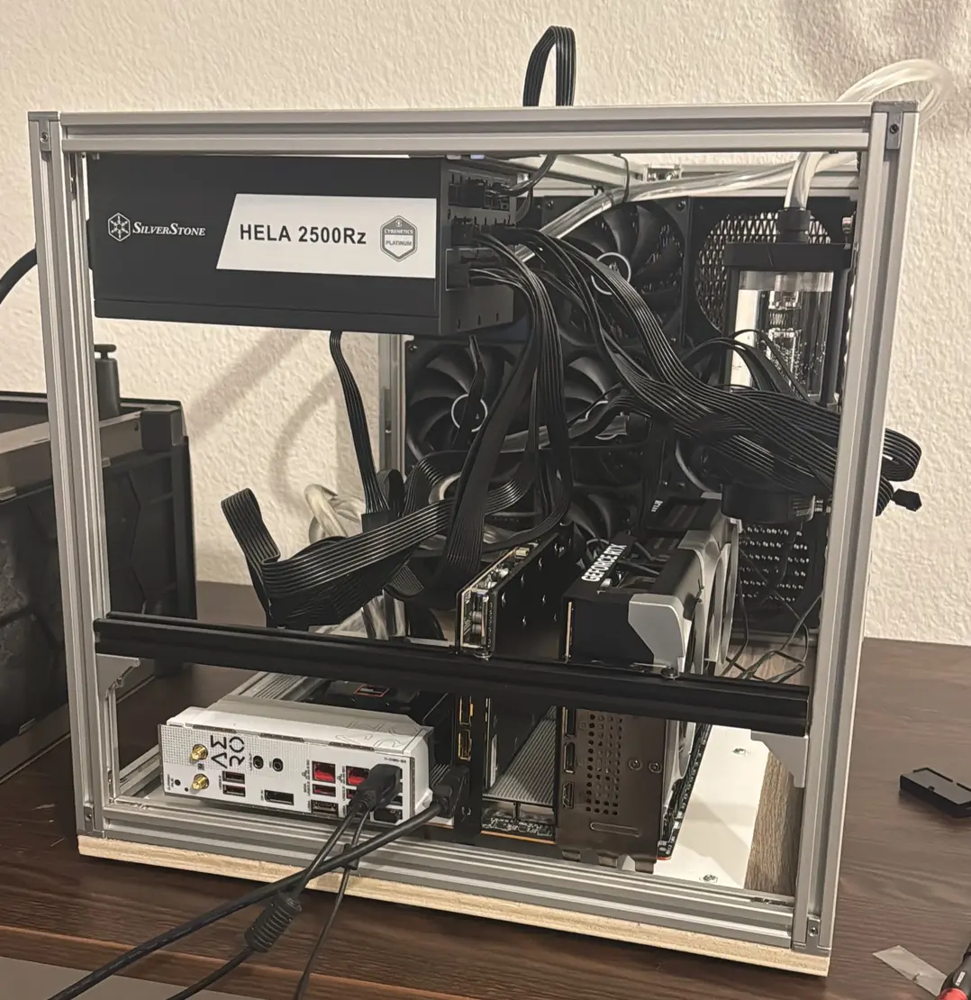

If you want to develop ML models, you have a few options, depending on the kind of models that you want to develop. Do you want to train LLMs (emphasis on the first "L")? Yes? Ok, are you incredibly rich ($>20m$ net worth)? Yes? Then you can go to NVIDIA and tell them to make you a 8x H200 server and send it to your home. You'll need to call your electrician though in order to turn the thing on. 

You aren't rich and still want to work on cutting edge, very large LLMs? I'd say, give up. This isn't a game meant to be played by the average mortal. You won't be able to afford the GPU costs to significantly move the needle in the LLM space. 

Smaller LLMs or models in general that are $<500m$ params? Now we're talking. Those are the kinds of models that you can train in a limited amount of time to a meaningful amount of performance.

For me, I don't care too much about very large LLMs AND I don't have much money. So I have really only 3 options for the GPUs:

- NVIDIA RTX 5090 (~2800€)
- NVIDIA RTX Pro 4000 (~1400€)
- NVIDIA RTX Pro 4500 (~2800€)

Out of these, the 5090 is king. It has the highest VRAM (32 GB), the most AI TOPS and (most unfortunately) the highest power draw as well (575W - ouch!) For training, I'd say this is the best candidate. The RTX Pro 4000 and 4500 are not bad and very power efficient (important for large datacenters) but I'd say are most suitable for inference tasks. So, the 5090 it is!

But before you go ahead and buy 2 5090s, make sure that your home **can** even run such a computer. Having two 5090s (and also the rest of the PC) means that you will need to have a PSU with at least 2200W, ideally 2500W (the [hela](https://www.amazon.de/Silverstone-Cybenetics-vollst%C3%A4ndig-ATX-Netzteil-SST-HA2500R-PM/dp/B0FF9X8CM7) is a good PSU for this - non affiliate link by the way). If you are in the US, your wall might not even allow you to pull that much energy (granted, you wan't always reach continious 2500W, but realistically between 1500W and 2000W). For us in Europe our walls provide 240V and especially in Germany, you can comfortably pull around 3000W. If you need more, then look behind your oven, you could find a high voltage adapter there.

**DO NOT TOUCH THAT UNLESS YOU ARE A PROFESSIONAL! INTERACTING WITH MAINS VOLTAGE CAN KILL YOU!**

Ok but let's assume your wall provides enough energy, what else do you need?

For one, you'll need a fitting CPU such that it doesn't bottleneck your GPUs. But not any CPU will work. You'd think that if you just bought the latest i9, surely that would be enough but you're wrong. The important property to look out for is PCIE lanes.

Your GPU is attached likely to a PCIE x16 connection, so this means it will need 16 PCIE lanes. Anything below that and you are bottlenecking the GPU. So if you have 2 GPUs, you will need at least 32 PCIE lanes. With other peripharals also wanting their own PCIE lanes, you will need at least 40. And **that** means you will need a **server** CPU, one that can handle that many. And if you need a **server** CPU, you will need a **server** motherboard. And you have a **server** motherboard, you will need **server** RAM, aka ECC RAM and those are - especially right now - ... let's just say, you don't have enough kidneys to sell to afford them.

My rig has an AMD 9960x (~1400€). Again, the metric to look out for is PCIE lanes. As for the motherboard, I used the Aero D one and my RAM (only 1 stick) is from Kingston Fury (a measly 32 GB stick).

If you have two GPUs you will need to make sure to have enough room between them. Don't forget that heat rises, so the top GPU will get fried if you put them too close together. In my case, I opted for watercooling the whole thing. One GPU is already watercooled, the other one will be too once my funds have increased. 

One more word on expectations: Just because you have 2 GPUs does NOT mean you will have 0.5x the training time! In many cases, it might actually be much slower. But why?

The reason is simple: NVIDIA did not include NVlink to the 5090. In fact, it stopped after the 3090. This means that in order to talk to each other, your GPUs use the PCIE from the motherboard. While by no means "slow" (~65 GB/s if I remember correctly) your 5090 is much faster than that, especially if you are training small models. 

That means that the 5090 does the forward/backward pass super duper fast, and then it wants to communicate to the other GPU. Now it has to wait until its data reaches the other GPU and in that time it does basically nothing. 

This means that you have 3 options:
- increase the batch size until computation time >> communication time
- increase model size until computation time >> communication time
- run two experiments at once

Unless computation time >> communication time is true, having 2 GPUs is slower than having 1 GPU.

By the way, here is my beauty, which I named "Talon":

