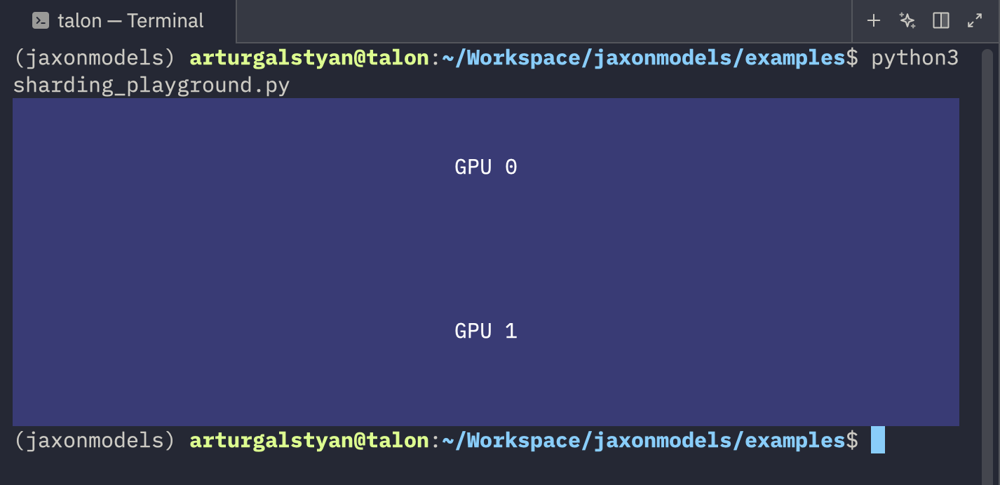

When it comes to machine learning, one of the "hottest" things is to use as many GPUs as you get your dirty hands on to train ever larger models (that is of course if you are a big company, otherwise it's probably as cold as a [supervoid](https://en.wikipedia.org/wiki/CMB_cold_spot)). 

One of the good things about JAX is that they make it _okay-ish_ simple to distribute your ML code across multiple devices. **Fortunately**, they also wrote quite a lot of examples and tutorials on that topic:

- [Distributed arrays and automatic parallelization](https://docs.jax.dev/en/latest/notebooks/Distributed_arrays_and_automatic_parallelization.html)
- [Explicit sharding (a.k.a. “sharding in types”)](https://docs.jax.dev/en/latest/notebooks/explicit-sharding.html)
- [Manual parallelism with `shard_map`](https://docs.jax.dev/en/latest/notebooks/shard_map.html)

**Unfortunately**, JAX documentations can also sometimes (certainly not always!) be a bit like reading a blog post by some esoteric super genius that swears by monads and writes code primarily in Haskell (or Rust if he feels funky that day).

In other words, it might be a bit overcomplicated for someone just looking for a super simple quickstart guide. 

(Altough admittedly, those JAX tutorials are on the easier-to-understand side, than some [others](https://docs.jax.dev/en/latest/autodidax.html))

## Quickstart

There are 2 ways you can do distributed ML:

- Data Parallelization
- Model Parellelization (I will skip this for now)

I write "Parallelization" because that's how it's usually called in other tutorials, but really, you can think of it also as _data replication_ AND _model replication_, i.e. what gets replicated where.

### Data Parallelization (Data Sharding & Model Replication)

This is by far the easiest one. You have 2 GPUs and a large batch size (e.g. 1024). You also know that your model fully fits on a single GPU. 

The idea is to **shard** (i.e. split) your data **evenly** across your GPUs AND **replicate** your model on ALL your GPUs.

This means that after sharding, you can imagine your GPUs have this data:

- GPU1: 100 % model, 50 % data (batch size of 512)
- GPU2: 100 % model, 50 % data (batch size of 512)

This is probably what you will be using mostly. 

```python 
batch_size = 1024
data = jax.random.uniform(key=jax.random.key(22), shape=(batch_size,)) # some random data 

mesh = jax.make_mesh((2,), axis_names=("batch",), axis_types=(js.AxisType.Auto,))

data_sharded = eqx.filter_shard(data, js.NamedSharding(mesh, js.PartitionSpec("batch")))
jax.debug.visualize_array_sharding(data_sharded)
```





There are 2 crucial lines that we need to address:

```python
mesh = jax.make_mesh((2,), axis_names=("batch",), axis_types=(js.AxisType.Auto,))
```

and 

```python
data_sharded = eqx.filter_shard(data, js.NamedSharding(mesh, js.PartitionSpec("batch")))
```

On the first line we create a so-called "mesh". A mesh needs to know 3 things: its layout, the axis names (and the axis types, but we just set those to be auto and that's also what you would need to make it work with equinox's `filter_shard` method, but you could also use `jax.device_put(...)` instead in this simple example without the `axis_types`).

In this example, our mesh has the layout `(2,)`, which means we have 2 _rows_ of devices (e.g. `(4,2)` would mean you have 8 devices at 4 rows and 2 columns). Although **I** called it "rows", **you** don't have to call that axis a row, in fact, that's why we have the `axis_names` for. The first axis (also the only axis in our case) is named "batch".

On this line
```python 
data_sharded = eqx.filter_shard(data, js.NamedSharding(mesh, js.PartitionSpec("batch")))
```

we basically tell JAX to take our data and shard it across the mesh. We then specifically tell it to shard it across the axis with the name "batch".

If you look at this image again


you will notice that the data has been sharded across the first axis (hence why you see two "rows" in this image).

We also need to **replicate** our model. See this code:

```python
    import jax.sharding as js

    mesh = jax.make_mesh(
        (len(jax.devices()),), axis_names=("batch",), axis_types=(js.AxisType.Auto,)
    )
    data_sharding = js.NamedSharding(
        mesh,
        js.PartitionSpec(
            "batch",
        ),
    )
    model_sharding = js.NamedSharding(mesh, js.PartitionSpec())
```

We created two shardings: one for the data (as before) and then another sharding without a specific partition spec. And this is a special case in JAX. If you don't specify a specific axis in `js.PartitionSpec()` and then call `eqx.filter_shard(..., js.PartitionSpec())`, then it will not SPLIT your data, but rather REPLICATE it. For instance if we did this:

```python
    optimizer = optax.chain(
        ...
    )

    model = Model(vocab_size, embed_dim, time_embedding_size, key=model_key)
    opt_state = optimizer.init(eqx.filter(model, eqx.is_array))
    model, opt_state = eqx.filter_shard((model, opt_state), model_sharding)
```

Then we have effectively copied our model across multiple devices!

But in order to use our model, we need to split the data first:

```python
x_0_batch = eqx.filter_shard(x_0_batch, data_sharding)
```

And then if we call the model on this `x_0_batch` we will get the FULL output back (not just 2 chunks, one for each GPU).

And that's one of the great things about the JAX compiler. While you CAN hold its hand (if you think you can "beat" it), in most cases, the JAX compiler is smart enough to do all the necessary computations for you.
