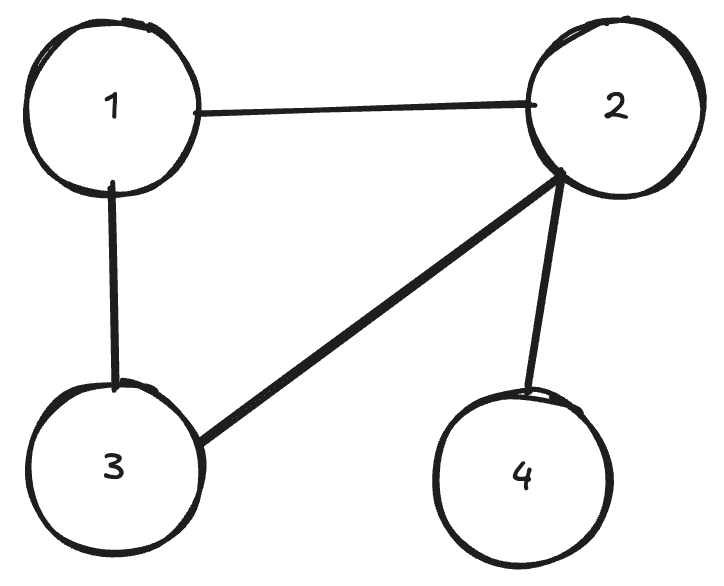

# Graph Neural Netwroks - Quickstart (DRAFT)

Many things in life can be represented easily as graphs. One classical example would be a social network, where nodes are people and edges between the nodes represent some kind of connection, like friendship for example. Here's a simple example of a graph.



GNNs allow us to make some kind of prediction on the whole graph or parts of it. E.g. if the whole graph was a molecule, you could try to predict chemical properties of it. You could also predict a missing connection (edge) between some nodes. Lots of interesting things!

How do we represent a graph like this in order to feed this to our neural network? First, lets think of the features of each node using our example of molecules. Each node (atom) could have several properties, such as atomic weight, number of neutrons etc. We simply denote the number of features per node as $n$ and the number of total nodes as $m$. If we were to list them in a matrix, it would have the shape $m\times n$, i.e. $m$ nodes, each with $n$ features. We could feed this directly into our neural network (nothing in the universe stops us from doing this), but we'd be missing the most crucial aspect, which makes a neural network a **graph** neural network, namely the **neighbours**. 

A simple $m\times n$ matrix doesn't capture the information that node 1 is connected to node 3 and 2. So how do we include this information? To do that, we need to represent somehow which node is connected to which other node. This is called an adjacency matrix. If there is a connection between the nodes, the value is 1, else 0. For the example above, the adjacency matrix looks like this $m\times m$ matrix:
$$
	\begin{bmatrix}
		1,1,1,0 \\
		1,1,1,1 \\
		1,1,1,0 \\
		0,1,0,1 \\
	\end{bmatrix}
$$
Note that we put $1$s on the diagonal. This effectively means every node is connected to itself, so it remembers its own information during the update.

Ok, now we know which node is connected to which other node and each of the features of our nodes. To summarise the shapes, we have an $m\times n$ matrix which hosts the features of our nodes (which we will call $F$ from now on) and an $m\times m$ adjacency matrix (called $A$). But we can't just do $A \times F$  and call it a day. Think about what $A\times F$ means. You take the rows of $A$ and multiply by the columns of $F$. Let me introduce a concrete example with some made up numbers:
$$
	A = \begin{bmatrix}
		1,1,1,0 \\
		1,1,1,1 \\
		1,1,1,0 \\
		0,1,0,1 \\
	\end{bmatrix}
	F = \begin{bmatrix}
		0.0,0.5,3.0 \\
		1.0,1.0,1.0 \\
		1.0,0.0,2.0 \\
		1.5,1.0,0.0 \\
	\end{bmatrix}
$$
Each column of $F$ represents the first feature value of every node, and each row of $A$ tells you to which nodes that node is connected to. Lets look at the first row of $A$ and first column of $F$:
$$
	[1,1,1,0], [0.0, 1.0, 1.0, 1.5]
$$
When we multiply these element-wise and then take the sum, we get the value of the solution matrix at position $0,0$ (i.e. the top left value). In this case, the solution is $1 * 0 + 1 * 1.0 + 1 * 1.0 + 0 * 1.5 = 2.0$. But this is kind of flawed. What if our first node had 1000 neighbours, and the second node had only 1? In this case, the value for the first node would be MUCH bigger than for the second one and further along the network it might just get bigger and bigger, leading to a gradient explosion later on. The solution to this problem is to _normalise_ the adjacency matrix by their degree. This sounds complicated, but really isn't. All you need to do is to divide $A$ by the _sum along the second axis_. E.g.:
$$
	A = \begin{bmatrix}
		1,1,1,0 \leftarrow sum = 3 \\
		1,1,1,1 \leftarrow sum = 4 \\
		1,1,1,0 \leftarrow sum = 3 \\
		0,1,0,1 \leftarrow sum = 2\\
	\end{bmatrix} \quad

	d = \begin{bmatrix}
		3 \\
		4 \\
		3 \\
		2 \\
	\end{bmatrix}
$$
One thing to note is that our $A$ matrix has ones along its main diagonal, therefore $d$ can't have $0$ in it. But this is not always the case, especially if not all graphs have the same number of nodes. In that case you add "ghost" nodes (kind of like a padding). Those don't have neighbours and should be disregarded throughout the neural network, therefore we can't have THOSE also have a $1$ in the diagonal. But, to make sure that we don't divide by $0$, we would usually do something like this
```python
degree = jnp.sum(adj, axis=1, keepdims=True)

safe_degree = jnp.where(degree == 0, 1.0, degree)
norm_adj = adj / safe_degree
```
Let's think about what this normalisation actually did. Instead of taking the whole feature value of a neighbour node, we just take a little bit of it instead and we do that for every neighbour value. Now, when we aggregate our nodes, like this
```python
aggs = norm_adj @ nodes
```
then each node in the `aggs` matrix (of shape $m\times n$) also contains some information about its neighbours as well. 

(Note that we haven't done any _learning_ yet, so far we just averaged. We can now take this `aggs` matrix and pass it to a linear layer to have some trainable parameters)

Concretely for the first node and the first value, we had before this:
$$
	[1,1,1,0], [0.0, 1.0, 1.0, 1.5]
$$
But if we normalise, we get this:
$$
	[0.33,0.33,0.33,0], [0.0, 1.0, 1.0, 1.5]
$$
Multiply and take the sum, the total is $~0.67$. This number contains the information from the original node ($0.0$), a bit of the first feature of node 2 ($0.33 * 1.0$), a bit of node 3 ($0.33*1.0$)  and none of node 4 ($0.0 * 1.5$) because it is not connected to that node 4. In a way, we collected the information of the neighbours of node 1 and put it all together into this single number. And by the way, this is also the reason, why this type of GNN is called a convolutional GNN, because we computed the convolution between our node and its neighbours using a fixed 'averaging' kernel defined by the graph structure.
