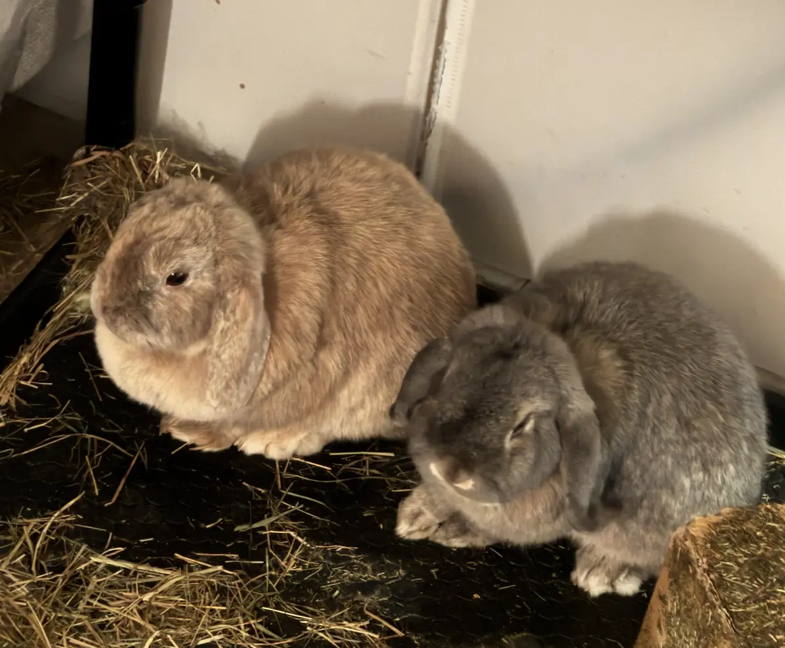
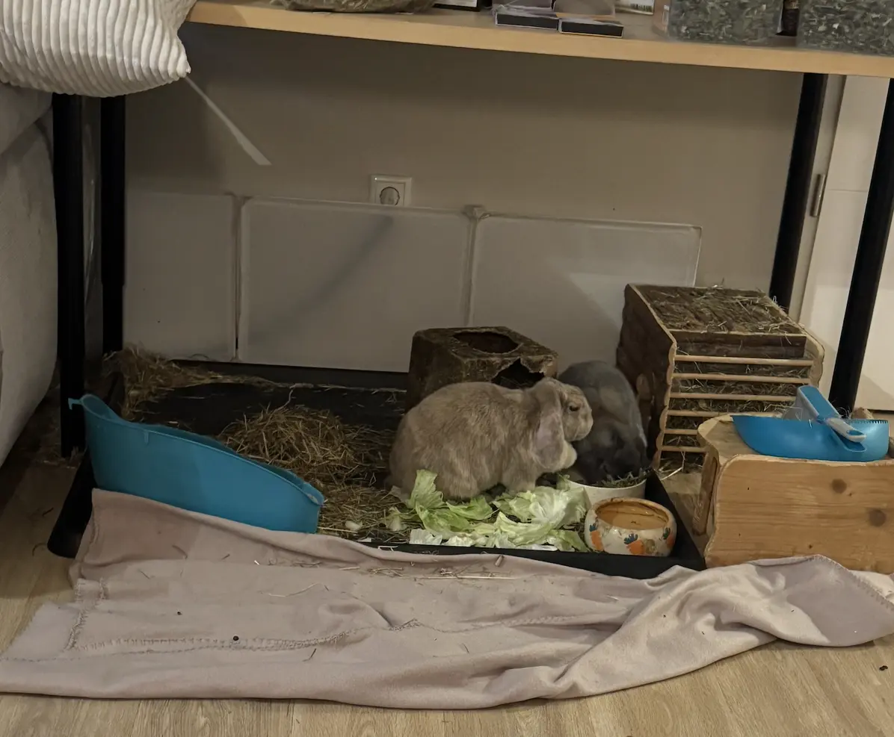
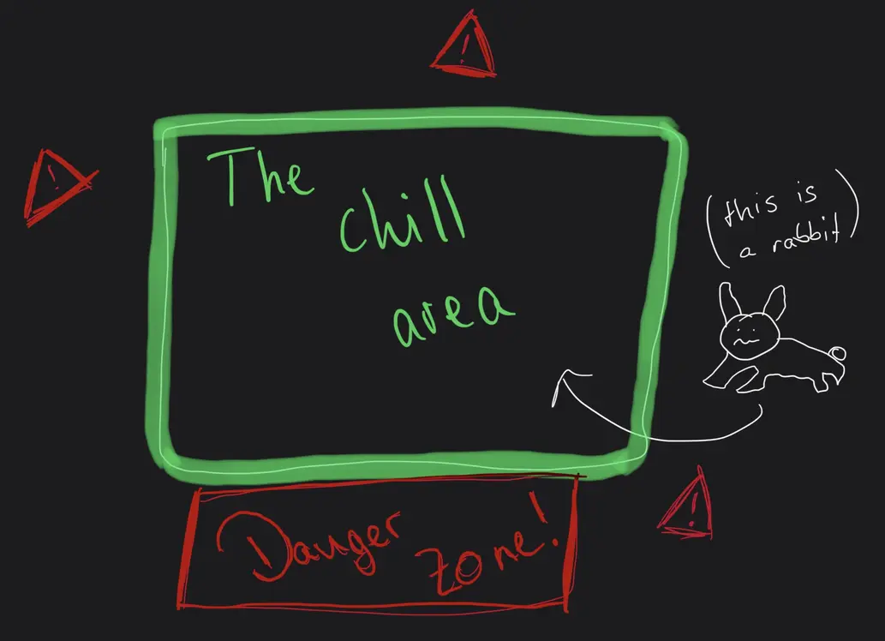
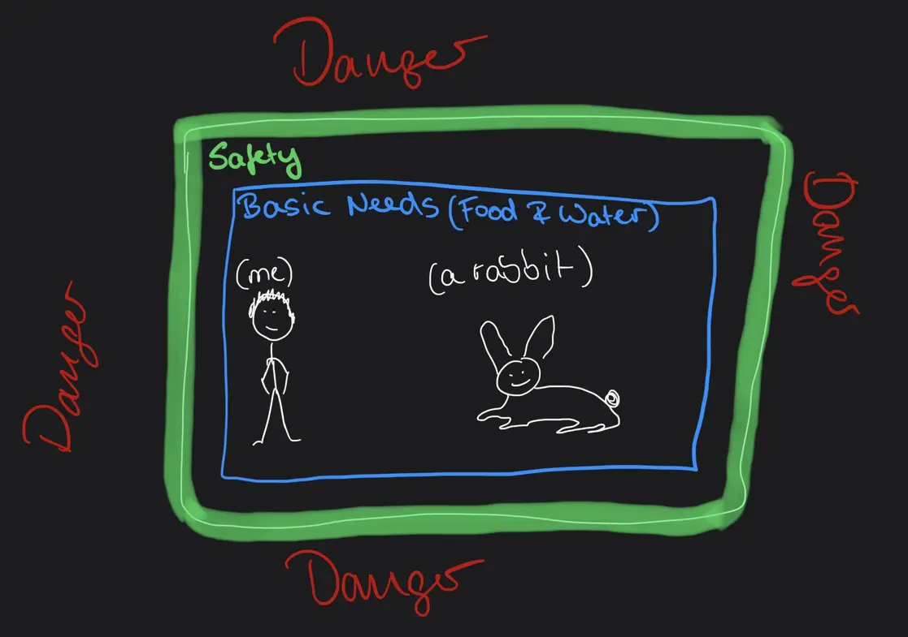
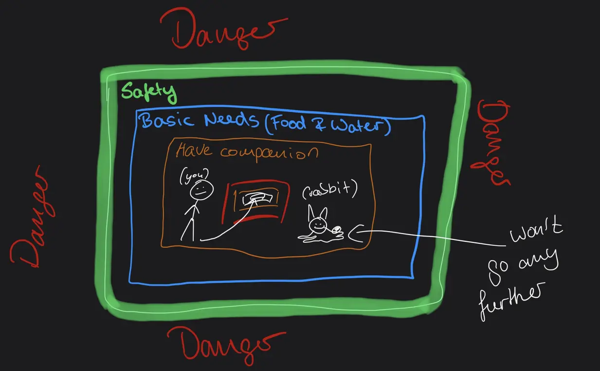
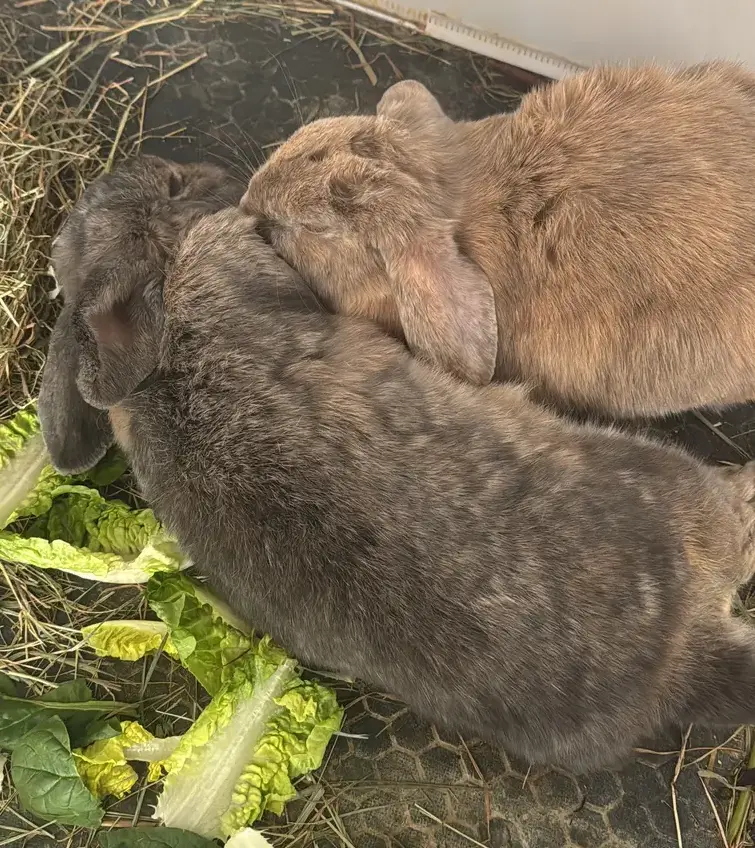

This is more of a philosophical blog post and if that's not what you were looking for, I'd suggest you skip this one.

Some of my friends are now visiting the Philipines and as usual when they go traveling, they ask me to look after their pets. I never had any pets myself but I love animals, so when they ask me I usually say yes before even asking for the date or duration.

They have 2 cats and 2 rabbits. We will ignore the cats for now just as they are mostly ignoring me and focus on the rabbits instead. Here they are:

The orange-y coloured one is a female named Nayla and the grey one is a male named Monti. Cute names for cute rabbits.

Now, I'm not an expert when it comes to rabbits (or any animal for that matter) - all I can do is observe, and observe I do.

Let me give you an overview of the apartment first. It's roughly $82m^2$ living area in total. There's a large living room with an open kitchen, a long hallway that's connected to the bedroom, the bathroom and an office. For such small animals, that's quite a lot of space. Where do you think they spent most of their time?

That's right, on their plastic mat, which is probably less that a single square meter of space. At most, they sometimes walk around in the living room and hop from corner to corner, but that's it. They never go outside of the living from even though there is no physical barrier.

Their Little Corner

So, what do rabbits _do_ all day? It seems to me that the answer is mostly nothing. They sleep a lot, they eat, and occasionally jump around.

**But I'm convinced that these two rabbits are the happiest, most fulfilled beings I have ever seen.** Certainly more than I ever was and likely ever will be. More fulfilled than any single person or couple I've ever met in my life. To me, they are the embodiment of happiness. Let me explain why and create a sort of framework for happiness. 

Let's start with the most basic requirement. For one, there's no danger at all. In nature, rabbits are near the bottom when it comes to the food chain. They are physically pretty weak, weigh barely anything and don't really have any defenses. But here, in this living room, there is no food chain. No danger to their lives whatsoever. That's a baseline requirement for happiness. Most of us humans - though certainly, and very much unfortunately not **all** - meet this requirement. Also note that this is completely artificial and doesn't really exist in nature. We humans molded our environment into this safe zone.

Secondly, there's an abundance of food, that they don't have to work or spend any energy for. Because their owners love them, it's always guaranteed that they won't starve to death. But they don't know this. They can never understand where exactly this food comes from. As soon as their owners leave their field of vision, from the rabbit's perspective they've just entered the aether. After some time they come back and have some fresh vegetables with them that they happily share with the rabbits. For all they know, it just appeared out of thin air. This is the second baseline for happiness - fulfillment of basic needs, like hunger and thirst - which unfortunately again, not all of us humans sadly posess. Interesting fact: rabbits die if they don't eat for 12 hours. This is because of their digestive system, which requires them to eat constantly or else they can't poop and die.

Ok, so there's no danger and they have food. But I'm in a similar situation. As a human living in a city, there is no real danger to me and because I have a job, I have a roof over my head, running water and a steady food supply. Sure, there are cars and busses and trains that each could flatten me like a bug if they hit me, but so long as you are careful, minimise the amount of time **you** drive and maximise public transportation, those dangers are negligible. So why am I not happy while these rabbits probably are? For billions of years, animals had to fight fiercely to secure even a fraction of the resources that I have avaiable, so why am I not happy? 

Having gotten into stoicism recently, the stoic's answer is that true happiness comes from within. Only **you** can make **yourself** happy. Everything else is external. Your wife, your kids, your friends, money, your pet. All externals, all can be lost but you will remain. You shouldn't attach your happiness to an external, because externals can disappear. Your girlfriend can leave you. You can lose all your money with a single click. Your kids can die in a car accident.

And to a certain degree I agree with the stoics (though I don't see eye to eye on certain other stoic principles) and it works for us intelligent humans, but what about these rabbits? They don't have the cognitive abilities to understand philosophy. Do they have the concept of _externals_? Is Nayla an external from Monti's perspective?

No. 

Having observed these rabbits I can say that to each other they are their entire universe. They are bound to each other. Like two souls connected to each other, yet blissfully unaware of anything outside their universe. Should one of them perish, the other's entire world would crumble. This is also the reason why you should always have at least two rabbits if you chose them as pets. Alone, they just wither away. 

Nayla was not always at Monti's side. Before her, there was Luna, Monti's daughter. She died not too long ago. During this time, so the owners told me, Monti was depressed like never before. Just sitting in his corner, facing the wall and never hopping around like he used to with Luna. His whole universe gone, yet he would never really understand why. As soon as Nayla came into his life, so did his own life. His universe complete again, happiness restored, just like that.

But this is nothing special to rabbits. We all have other people that we deeply care about, our own lives withering away as soon as we lose those we love. 

The difference between human happiness and rabbit happiness is - at least in my oppinion - our intelligence. I believe the more intelligent a being is, the less happy it can become. **Intelligence and happiness are diametrically opposed.**

Evolutionary pressure forced us humans to become more and more intelligent until we learned that the world was something we could shape to our advantage. From that point onwards, we become the superintelligent apex preditor basically without any competition (except for maybe ourselves). Evolution doesn't care if you are happy. All it cares about is that you procreate and pass on your genes.

But we are humans, cursed with intelligence, burdened by mother nature's unquenchable thirst for progress, with utter disregard for your personal goals. You just want to be happy. But our intelligence forces us to eventually do **something**. You can't just sit in a small corner all day. You'll get bored and boredom is torture to our brains. Just ask anyone who was ever in solitary confinment. We humans are compelled by our brains to overcome boredom. And so we must march further _into the rabbit hole_ of happiness. And I think, the more intelligent you are, the further inwards you have to travel. 

But the problem is that this path is undefined. With the other areas, you can objectively say if you've entered them. Are you safe? Do you have food, shelter and water? If so, congratulations, you've made it to the blue area. But if you want more, you're on your own. However, these rabbits, because they are not very intelligent, they don't have to travel very far. As soon as they have their companion, they have reached their destination. No need to go any further. No further ambition, no need to win a nobel prize in physics or be a boss in a large rabbit company or anything like that.

You on the other hand are probably not content with just having a partner, it's probably not enough, at least usually not for us people in the western world. You have ambition. You'll want to achieve __something__. Found a wife? Nice. Next goal: kids. Got those? Great. Now what? Maybe a house. Got that? Superb. And next comes...

And it will never stop. In a way, stoics are right. All those things you are collecting are externals. You will keep piling more and more - because your brains compell you to - and it will never be enough. You'll always want to do more, traveling ever further down the path, with no end in sight. If only you were born a rabbit, then your journey would have ended long ago. 

So what should you do? How can we achieve happines? The Stoics argue that true happiness must be independent of externals. I agree, but for us, it is a much harder battle than it is for Monti and Nayla. We cannot simply turn off our intelligence or our biological drive for progress. We cannot un-evolve. You'll have to find another way. This is a universal human struggle and we've been looking for it since the day we became conscious hundres of thousands of years ago. Our intelligence is both a blessing and a curse. Blessed with the ability to completely eradicate any threat to us, cursed with the inability to stop. 

However, recognizing that our brains are wired to keep us unsatisfied is the first step. When you feel that itch for more—more money, more status, more "things"—realize that it isn't a requirement for happiness, they are externals. It is just your evolutionary programming telling you that you need these things to survive. We have to learn to use our intelligence to appreciate what we have, rather than letting it torture us with what we don't.

While it's incredibly hard to fight millions of years of biology, one of the most effective exercises you can make is to write down what you are grateful for. This will start to rewire your brain into being content with what you have instead of being discontent for all the things you don't have. 

And by the way, here are the two cats:

</img>
</img>

