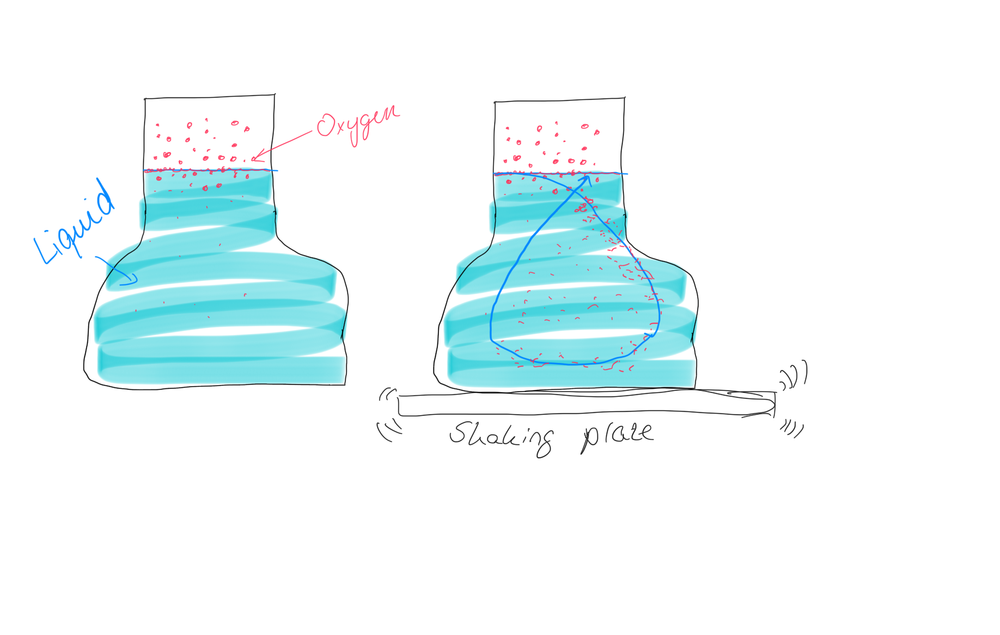
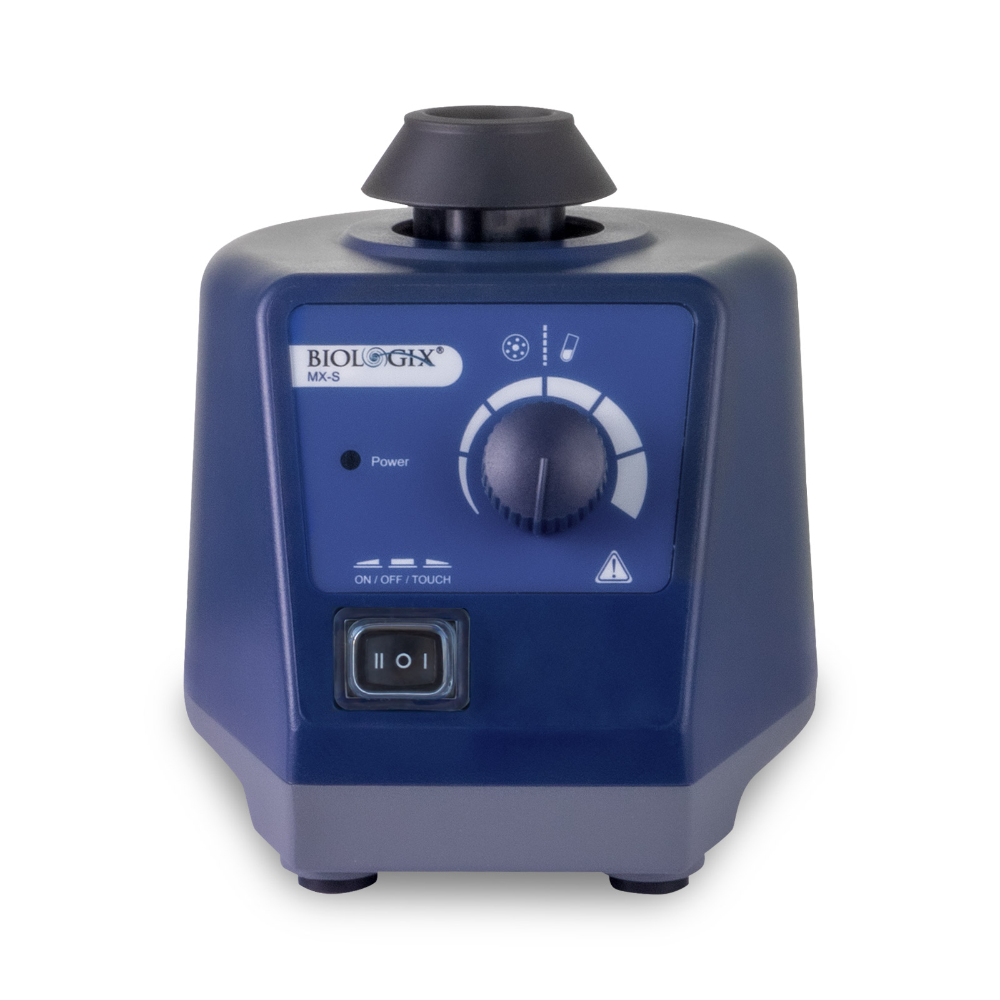
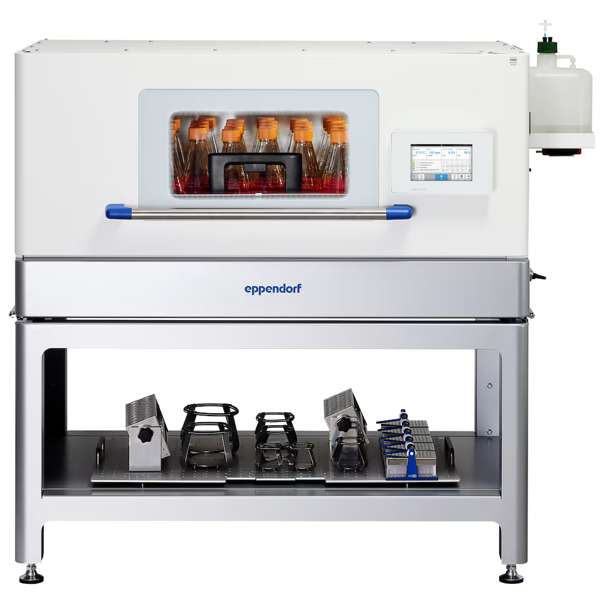
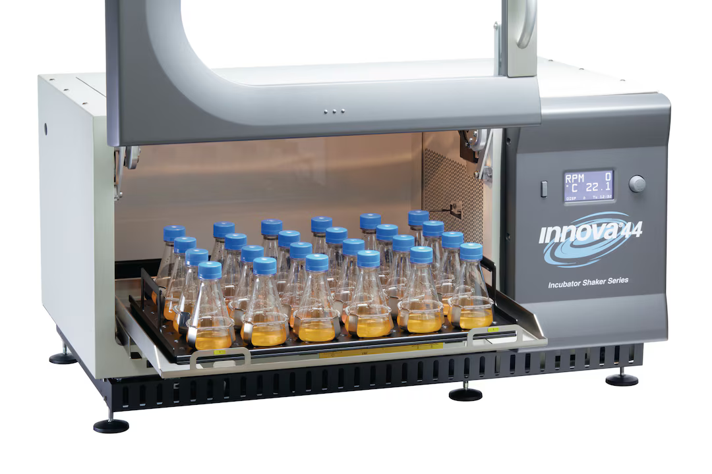
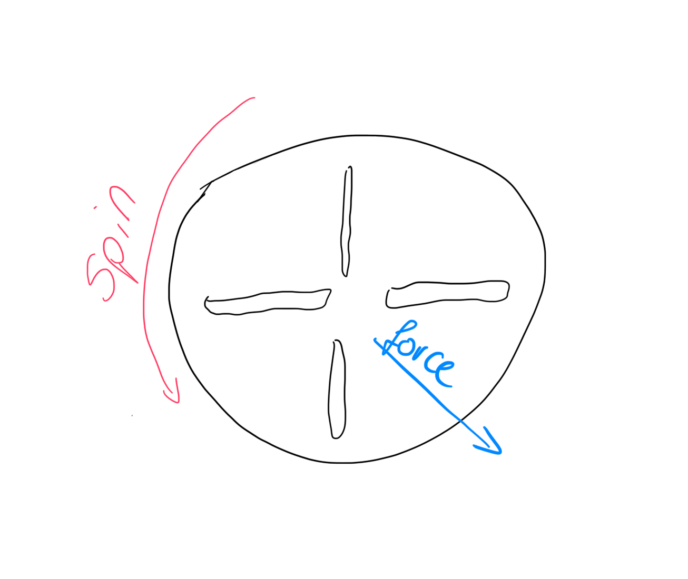
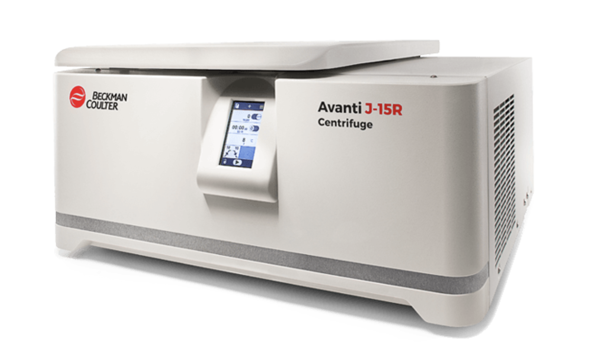
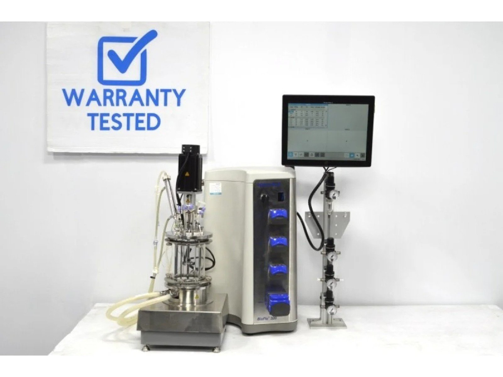

# Context

**Disclaimer: Everything here comes from my own research on the internet and is publicly available. This is just the blog of a future employee who can't wait to start and got a head start on preparing. I've not yet worked in a lab, so if you were looking for some expert opinion or insights, you've come to the wrong place!**

Sooo, it finally happened! I recently landed a new job at Roche in Basel, Switzerland and this new role I'm assuming is that of a _Lab Automation Engineer_ (LAE). This is extremely exciting and it finally lets me break free from pure fullstack development into a more challenging domain. Not to mention the fact that it's a new country I'm moving to, that is roughly a thousand kilometers away from home, which just hypes me up even more. Needless to say, I'm counting the days until I get started (which is ~3 months as of writing this).

In university I was overly eager to start learning about my classes before the semester even began and it seems as if I still carry this property even after graduating 5 years later. Currently, the issue is that although I would say that I'm a pretty good generalist builder, I'm certainly lacking domain expertise in the pharma industry. But I still have 3 months to prepare, so better get started.

Naturally, one of the first questions one might have is: what the heck even _is_ a lab automation engineer? Let's find out.

# What even is a lab??

Before we can answer what a LAE is (and does), we first have to look at what a lab even is. We all have an image in our heads: someone in a lab coat, holding a flask with some coloured liquid in it and a bunch of microscopes in the background. But perhaps we can find more grounded information. Let's ask Google. A few search results later, we find the website of Fraunhofer and specifically this image:


Now *that* is a lab if I ever saw one. Scrolling down a bit, we can see a YouTube video with another interesting photo:


By eyeballing these two images - and currently being pretty oblivious about labs in general - I would say that the first image _seems_ to be _more_ automated than the second one. But that is not really the point right now. What is interesting is what kind of devices we can spot in these images and then ask ourselves, what other devices can we usually find in labs. Each of them has a special purpose, usually doing _something_ to some liquid. 

There is no shortage of resources on the internet on this topic and you could probably fill a whole book on this, but I only have 3 months time. The 80-20 rule must be used here. We can look at [this](https://en.wikipedia.org/wiki/Category:Laboratory_equipment) Wikipedia page to get an overview but another good resource is any site that sells lab equipment (which also teaches you about what brands are out there). 

As humans, we like to categorise and put things neatly in boxes and that's what I will try to do here. I think in general you can split up lab equipment into two broad categories: (expensive as heck) electrical devices (think _oven, liquid dispencers, etc._) and single-use (-ish), generic tools (like IDK a pair of scissors or a [well](https://images.squarespace-cdn.com/content/v1/6435c4ef83064334cafe1395/8d78eb4a-1987-4184-a8cb-27c32872d932/irish-life-sciences_1.0ml-96-square-wells-low-profile-1r96-307ulp-bottom_1S96-016ULPjpg.jpeg)). The former is most interesting to us, but we shouldn't neglect the latter either. For now, we will focus on these electrical devices and if we have some time towards the end, also look at the most common instruments of the latter category.

## Frequently Used Lab Equipment

(Disclaimer: I have never worked in a lab! This list is just what I gathered from my research on the internets!)

Ok, so a lot of the work in a lab is just __moving__ liquids. Be it within the machine itself (e.g. shaking the liquid, spinning the liquid, etc.) or distributing the liquid into separate wells. 

### Pipettes

We start simple, with a relatively cheap, but probably very often used device: a pipette!

 

By "relatively cheap" I mean in relation to the other devices we will see later in this list. Each of these bad boys can set you back between 100€ and 350€! From what I can tell, the Eppendorf brand appears a lot and seems rather expensive; I can't speak for the quality yet but so far they seem to be a bit like the "Apple" in lab equipment. Fun fact: __Eppendorf__ is the name of a district in Hamburg and as a student I used to live there. Another fun fact: just like the lab equipment, Eppendorf is one of the more beautiful (and expensive) areas to live in Hamburg.

### Shake It Up!

Shaking liquid is also common practice in a lab. I'm not 100% sure why, but the analogy I have in my head is that of juice (or oat milk, same idea). The juice particles sink towards the bottom and settle there (they are the suspended solids). Drinking unshaked juice tastes bland (you're basically just drinking fruit-water without the fruit mixed in). After shaking it, the fruity-bits and the water have mixed and your juice tastes jucier. I'm not exactly sure what the right counterparts in a biotech lab are for this analogy, let me just quickly ask Dr. Claude...

Aaaand here is the response: The above section - while true - is not actually the main reason for shaking. What I described earlier is about __homogeneity__, but the main reason is for __aeration__. AFAICT, cells need to "breathe" oxygen. Air-y water only exists on the surface at the boundary between liquid and, well, the air. If you shake the liquid, the surface gets renewed (air-y liquid from the surface mixes into the water, non-air-y water moves to the surface, absorbs a bit of oxygen, moves away, and so on) providing the cells with oxygen there and not making them suffocation to death. Otherwise, growth of the cells would mostly be concentrated near the surface and thus be limited. 

Here's an image I drew that may (or may not) help your understanding:





My analogy above is also still valid: by shaking the liquid, instead of having one dense sludge of cells at the bottom, they are evenly distributed in the liquid such all cells kind of see the same particles (and nutritients) around them. 

(Shaking is also used for speeding up reactions and dissolving/resuspending)

Let's start with an orbital shaker:


This unit will set you back around 4000€. Yes. You saw that right. [Here's](https://www.youtube.com/watch?v=Y1YMsl6fDOI) a video that shows you what it does. It literally just shakes the platform in a circular fashion. Why it costs so much is beyond me.

Another way to shake liquids is to use a _vortexer_. A vortexer kind of just _wiggles_ its plate around and is often used for suspension (e.g. of cells). Think back to our juice and the juice particles that have settled at the bottom. If you were to wiggle the plate on top of which it stands, then the juice particles fly into the  liquid and _suspend_ "midliquid" and fly around there. Here's one from the "Biologix" brand: 



(Btw. nothing here is affiliated in ANY way, I just try to find out some of the common brand names as well)

You can also often find something called a shaking incubator. The shaking part we already covered, so what's an incubator? Well it's just an enclosed container that keeps a set of parameteres constant (mostly temperature). So a shaking incubator is an orbital shaker that ensures a constant temparature. Here's one from Eppendorf:



They can also look a bit like a microwave:



The latter one sets you back around 23000€, equipment so expensive, you can start to use scientific notation ($2.3e4$).

Often times, you want to grow cells to test whatever drug or compound you're developing. But cells don't just grow under any condition. They need a specific environment which stays constant, e.g. with a constant temperature or humidity. E.g. if you're growing human cells, you should make their environment close to our bodies, i.e. at a constant ~37°C. 

### Centrifuges

A centrifuge is a device that simply spins _something_ and that _something_ then experiences centrifugal forces. I'm sure most of us have been on a merry-go-round. On those, you can feel the centrifugal forces that push you out. Here's an image: 



If you have the misfortune to ride these death traps, you will have experienced it too. They say astronauts can withstand who-knows-how-many-gs but the final NASA test is to last in these for longer than 3 minutes. 


<div class="text-xs">Man do I hate these spinning teacups, why do they exist? Who rode those things and said "ah yes, a splendid idea"???</div>

When you have some proteins floating around in a liquid, then gravity is not enough to overcome the Brownian motion. You also don't really inspect individual proteins: in biology everything is so small that it moves towards statistics instead. You want _most_ of your proteins to be at the bottom and hopefully _most_ of those are the proteins that you were actually looking for. You also can't really "look" at a protein anyway (they are smaller than the spectrum of visible light). After you've moved most of the proteins towards the bottom of your container (which is what the centrifuges do), you can extract those, do some purification process and then perform _mass spectrometry_ so you can be _mostly certain_ about what protein you were working with. 

Here is a (chilled) centrifuge from Beckman Coulter:



I couldn't find the exact price for this (you have to request a quote), but it's probably ~6000€.

### ~Nuclear~ Bioreactor

We had already mentioned incubators. They control the environment of a closed off room, e.g. by holding a certain constant temperature. A bioreactor is related to that but instead of controlling the environment, it controls the culture. So there is a bunch of cells in your reactor and you want to control their "state". To do that, you have a few probes that read out metrics like pH, oxygen, nutrients, etc. This is something you might want to do in order to e.g. force the cells to produce a certain protein, something they might only do under the right circumstances. The bioreactor is basically what achieves and maintains that state. 

From the software point of view, a bioreactor is a constant stream of data that you have to log, understand and finally react to. 



These can get *very* expensive and for the top tier ones, scientific notation starts to make sense unironically. The one above costs around 18.000€, which is on the cheaper side from what I could find.

# What does a LAE do now?

Ok, so we already talked quite a bit about the hardware side of lab equipment, but (at least AFAICT) most of my job - in the beginning - will revolve around the software side of things, so its worth looking into that.

When it comes to lab equipment, they are pre-loaded with a lot of special software from the vendors, already able to _do_ things, perform certain actions that are generic enough for the vendor to put into the software. But what if you want to do something differently? 

Let's think of an example. Say you have a microscope from Mega Microscopes Inc. You look at some cells and then take a photo. By default, the device uploads it to the Mega Microscope Cloud. From there, you download them and pass them e.g. to some ML model, which outputs the probability of what kind of cell you're dealing with. (I know this is pretty contrived but bear with me (or actually it might not be, I haven't started yet, so something like this might actually happen)). The issue is the middle step, which is that you have to go to the cloud to download it (of course you could work around that, build a proxy, API this, post request that yada yada but that's not the point). Ideally, you'd just want the microscope to directly forward that image to your ML model, which means that you have to _change the microscopes default behaviour_.

There are 2 ways to do that: call the vendor, pay them a lot of money and let them do it. Or do it yourself. That's where a LAE comes into play. Ideally, the LAE has already talked with the scientists (communication, clear understand of what is needed to be done is very important here!) and then writes software to do what the scientists actually need. In this case, you'd have to somehow *tap into the microscrope* and do *something*.

But how?

## The Software Landscape

Before we can get into the software landscape, we have to visualise a few layers. These are:

1. Device Layer: How do you talk *to* the device? (E.g. USB, Ethernet, *SiLa2* (VERY IMPORTANT))
2. Abstraction Layer: How do you abstract the device? (E.g. **PyLabRobot** (ALSO VERY IMPORTANT))
3. Orchestration Layer: How do you schedule the whole thing?
4. Information Layer: How do you store and retrieve information? (E.g. **Benchling**)


Although I might be wrong, I think - with my current knowledge - that a LAE works across all of these layers. So it makes sense to cover them. Let's start with the Device Layer.

### Device Layer

The Device Layer is the lowest layer and is responsible for talking to the device. There are multiple ways to talk to the device, like USB, Ethernet, and especially *SiLa2*. I keep mentioning this, but haven't really explained what it is yet. But before I do that, we first have to take a detour. Let me tell you a story about **PROTOBUF**.

#### Protobuf

Protobuf is probably for you one of these terms that you keep hearing about but don't really know what it is. Kind of like Docker in the 2015s until you actually sat down and interacted with it. In the most simplest explanation, Protobuf is a way to generate code from a schema and use it to serialize and deserialize data (at the byte level!).

Imagine writing an interface in Java, then running some Java binary, which then generates code for any language just by reading the interface file. This is what Protobuf does for you. Here's an example:

```proto
syntax = "proto3";

message Greeting {
    string name = 1;
    string times = 2;
    string message = 3;
}
```

If you generated Rust code from this and inspected it, you would see something like this:

```rust
// This file is @generated by prost-build.
#[derive(Clone, PartialEq, Eq, Hash, ::prost::Message)]
pub struct Greeting {
    #[prost(string, tag = "1")]
    pub name: ::prost::alloc::string::String,
    #[prost(int32, tag = "2")]
    pub times: i32,
    #[prost(string, tag = "3")]
    pub message: ::prost::alloc::string::String,
}
```

Pretty nifty, eh? But what do we actually do with this now? Well, we can instantiate a struct of this type and serialise and deserialise it. E.g. like this

```rust
use prost::Message;

pub mod intro {
    include!(concat!(env!("OUT_DIR"), "/intro.v1.rs"));
}

fn main() {
    let g = intro::Greeting {
        name: "shaker".to_string(),
        times: 3,
        message: "Hello, World!".to_string(),
    };
    println!(r#"{g:?}{}{}{}"#, g.name, g.times, g.message);

    let bytes = g.encode_to_vec();
    println!("encoded bytes: {:?}", bytes);

    let back = intro::Greeting::decode(bytes.as_slice()).unwrap();
    println!("decoded: {:?}", back);
}
```

If we run this code, we get this

```
Greeting { name: "shaker", times: 3, message: "Hello, World!" }shaker3Hello, World!
encoded bytes: [10, 6, 115, 104, 97, 107, 101, 114, 16, 3, 26, 13, 72, 101, 108, 108, 111, 44, 32, 87, 111, 114, 108, 100, 33]
decoded: Greeting { name: "shaker", times: 3, message: "Hello, World!" }
```

If we generate the protobuf in Python, we can also use it in a similar fashion:

```python
from intro.v1 import intro_pb2


def main():
    greeting_msg = intro_pb2.Greeting(name="shaker", times=3, message="Hello, World!")

    print(greeting_msg)

    serialized = greeting_msg.SerializeToString()
    print(list(serialized))

    deserialized = intro_pb2.Greeting()
    deserialized.ParseFromString(serialized)
    print(deserialized)


if __name__ == "__main__":
    main()
```

Printing this out gives us:

```
(pyclient) ➜  pyclient python3 greeting_struct_demo.py
name: "shaker"
times: 3
message: "Hello, World!"

[10, 6, 115, 104, 97, 107, 101, 114, 16, 3, 26, 13, 72, 101, 108, 108, 111, 44, 32, 87, 111, 114, 108, 100, 33]
name: "shaker"
times: 3
message: "Hello, World!"
```

And as you can see, the bytes are 1:1 identical! This is amazing, because we can now use this to guarantee that our projects - even though they are written in different programming languages - actually use exactly the same data.

And just for completeness, if you look at the generated Python code, then it would look something like this:

```python
# this is just an excerpt 

from google.protobuf import descriptor as _descriptor
from google.protobuf import message as _message
from typing import ClassVar as _ClassVar, Optional as _Optional

DESCRIPTOR: _descriptor.FileDescriptor

class Greeting(_message.Message):
    __slots__ = ("name", "times", "message")
    NAME_FIELD_NUMBER: _ClassVar[int]
    TIMES_FIELD_NUMBER: _ClassVar[int]
    MESSAGE_FIELD_NUMBER: _ClassVar[int]
    name: str
    times: int
    message: str
    def __init__(self, name: _Optional[str] = ..., times: _Optional[int] = ..., message: _Optional[str] = ...) -> None: ...
```

Let's go one step further, because `structs` is not the only thing we get from Protobuf, we can also define *services*!

Here's an example:

```proto
service GreeterService {
    rpc Greet(GreetRequest) returns (GreetResponse);
}

message GreetRequest {
    string name = 1;
    int32 times = 2;
}

message GreetResponse {
    string text = 1;
}
```

Services get the `service` keyword and functions inside it are defined as `rpc`s which stands for `remote procedure call`. In this case, our function gets a `GreetRequest` as input and returns a `GreetResponse`. 

You can generate this, but in the end, all you get is (borrowing from Java terminology) an interface or a `trait` (if you are from a Rust background) that needs to be implemented by someone or something. Because without someone to implement the logic, nothing would happen.

This is where introduce the concept of a `server` and a `client` in the context of gRPC. Perhaps this is a good moment to clarify the difference between these two:

*Protobuf*: Handles code generation and data serialisation (using the message types defined in the `.proto` file); in other words, it sits at the _data format_ layer.

*gRPC*: Is a remote procedure call framework; it uses `protobuf` per default. It takes the services defined in the `.proto` files and moves requests and responses over `HTTP/2`. In other words, it sits on the _network layer_.

Ok, so after generating the code for your programming language (in my case, Rust, so for me it's `cargo build --bin grpc-intro` - with `grpc-intro` being the name of my project; ask your LLM to create a custom made tutorial for your specific case, I'm just giving a high level overview, not a detailled tutorial), it's time to implement the service by writing out the `server` bit:

```rust
use tonic::{Request, Response, Status, transport::Server};

use crate::intro::{
    GreetRequest, GreetResponse,
    greeter_service_server::{GreeterService, GreeterServiceServer},
};

pub mod intro {
    include!(concat!(env!("OUT_DIR"), "/intro.v1.rs"));
}

struct MyGreeter;

#[tonic::async_trait]
impl GreeterService for MyGreeter {
    async fn greet(&self, req: Request<GreetRequest>) -> Result<Response<GreetResponse>, Status> {
        let r = req.into_inner();
        println!("Received request: {:?}", r);

        if r.times > 10 {
            return Err(Status::invalid_argument("times must be <= 10"));
        }

        let text = format!("Hi {}", r.name).repeat(r.times as usize);
        Ok(Response::new(GreetResponse { text }))
    }
}

#[tokio::main]
async fn main() -> Result<(), Box<dyn std::error::Error>> {
    let addr = "127.0.0.1:50051".parse()?;
    println!("Server listening on {}", addr);
    Server::builder()
        .add_service(GreeterServiceServer::new(MyGreeter))
        .serve(addr)
        .await?;
    Ok(())
}
```
We added a special case in which we throw an error if the `times` argument is > 10 (just to see how `gRPC` handles errors).

So now we have a server running. Using the same `.proto` file, we can once again generate the code for our other programming language (in my case Python) and implement a client there.

```bash
(pyclient) ➜  pyclient python -m grpc_tools.protoc \
  -I ../proto \
  --python_out=. \
  --pyi_out=. \
  --grpc_python_out=. \
  ../proto/intro/v1/intro.proto
```

First, the happy route (times < 10):

```python
import grpc
from intro.v1 import intro_pb2, intro_pb2_grpc

channel = grpc.insecure_channel("127.0.0.1:50051")
stub = intro_pb2_grpc.GreeterServiceStub(channel)

resp: intro_pb2.GreetResponse = stub.Greet(intro_pb2.GreetRequest(name="Artur", times=8))
print(resp.text)
```

When we run this code, we notice on our Rust console, that a request came in:

```
Server listening on 127.0.0.1:50051
kReceived request: GreetRequest { name: "Artur", times: 8 }
```

(great formatting)

And on the client side, it says:


```
(pyclient) ➜  pyclient python3 client.py
Hi ArturHi ArturHi ArturHi ArturHi ArturHi ArturHi ArturHi Artur
```

Amazing! Let's try to force an error by increasing the `times` argument to be > 10. If we do, we get this:

```
(pyclient) ➜  pyclient python3 client.py
Traceback (most recent call last):
  File "/Users/arturgalstyan/Workspace/learn-labautomation/grpc-intro/pyclient/client.py", line 7, in <module>
    resp: intro_pb2.GreetResponse = stub.Greet(intro_pb2.GreetRequest(name="Artur", times=11))
                                    ~~~~~~~~~~^^^^^^^^^^^^^^^^^^^^^^^^^^^^^^^^^^^^^^^^^^^^^^^^
  File "/Users/arturgalstyan/Workspace/learn-labautomation/grpc-intro/pyclient/.venv/lib/python3.13/site-packages/grpc/_channel.py", line 1168, in __call__
    return _end_unary_response_blocking(state, call, False, None)
  File "/Users/arturgalstyan/Workspace/learn-labautomation/grpc-intro/pyclient/.venv/lib/python3.13/site-packages/grpc/_channel.py", line 999, in _end_unary_response_blocking
    raise _InactiveRpcError(state)  # pytype: disable=not-instantiable
    ^^^^^^^^^^^^^^^^^^^^^^^^^^^^^^
grpc._channel._InactiveRpcError: <_InactiveRpcError of RPC that terminated with:
	status = StatusCode.INVALID_ARGUMENT
	details = "times must be <= 10"
	debug_error_string = "INVALID_ARGUMENT:times must be <= 10"
>
(pyclient) ➜  pyclient
```

I don't know about you, but to me this is pretty amazing. Look at the clean error message that we get, we know exactly what went wrong AND get the details from our Rust server. Just wow! 

In this case, of course our client paniced, crashed and burned to the ground. Normally, we would wrap this in a `try`/`except` kind of loop and handle these errors. And the great part is that you can also define the error message types from `.proto` and in your client handle those accordingly. The possibilities are truly endless.

Let's summarise what we learned so far:

- we learned about protobuf and how we can use it to generate messages and interfaces in any programming language
- we learned about gRPC and how we can implement a server and a client (even in different languages) and have them talk to each other
- all from a single `.proto` file

### Back to the Device Layer

After this short excursion to `protobuf` and `gRPC`. What does all this have to do with the device layer. Well, there is a standard which sits on top of both these and it is called `SiLA2`, which stands for **Standardization in Lab Automation**. 

So the flow goes like this:

`SiLA2` (provides the `.xsl` rules - we will get to this in a second) -> `.proto` file -> code

To understand this flow though, we need to make another detour into `xsl` but I promise, this one is going to be short!

#### Ugh.. another detour? XSL(T)

An `.xsl` file is an `.xml` file which contains an **XSLT stylesheet**.

An **XSLT stylesheet** (short for eXtensible Stylesheet Language Transformations) defines the rules to translate an `.xml` file into a different file type (in our case, into a `.proto`) file. For example a `<Command>...</Command>` tag in the `xml` file gets translated into a `rpc` in a `.proto` file.

### Back to the Device Layer (ok that really was short)

SiLA2 is what gives us these rules (if you download the files (I will showcase this later), you will find a file called `fdl2proto.xsl` which contains these files). Ok, now you have an `.xml` file (be patient, you will see this soon enough) and using the rules that SiLA defines, we generate a .proto file using a library called `xsltproc` (but you can use any other library, there are others). And now that we have the `.proto` file, we generate the code and implement the server/client. 

And here is one unfortunate fact about the world. **Not every vendor gives you these files / supports SiLA**. And this is a big shame. Because if they did, we as the developers, wouldn't need to have any other layers or need to reverse engineer anything. They would give us the `xml` file (which contains everything this device can do and what functions it has etc.) and we'd just write our software around it, call the device directly, etc. But this is not the case -- yet another reminder that we don't live in a perfect world. Why? Because the vendors bank on you wanting some extra functionality and that you'd HAVE to go to them so they can make more $$$.
