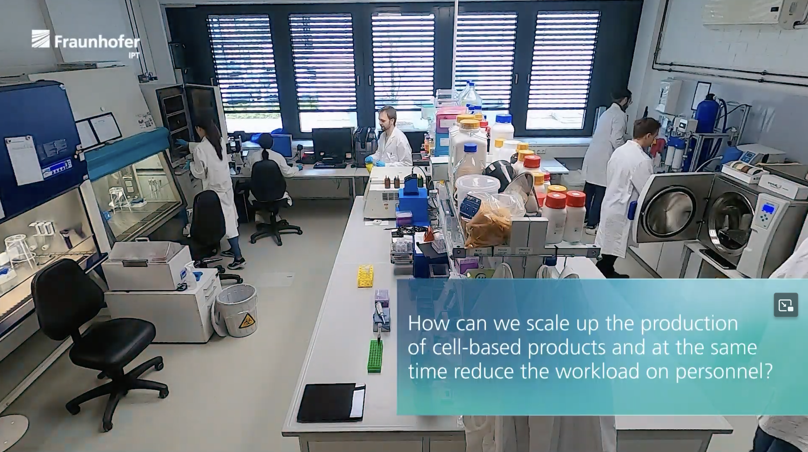

# Context

Sooo, it finally happened! I recently landed a new job at Roche in Basel, Switzerland and this new role I'm assuming is that of a _Lab Automation Engineer_ (LAE). This is extremely exciting and it finally lets me break free from pure fullstack development into a more challenging domain. Not to mention the fact that it's a new country I'm moving to, that is roughly a thousand kilometers away from home, which just hypes me up even more. Needless to say, I'm counting the days until I get started (which is ~3 months as of writing this).

In university I was overly eager to start learning about my classes before the semester even began (to give me an edge) and it seems as if I still carry this property even after graduating 5 years later. Currently, the issue is that although I would say that I'm a pretty good generalist builder, I'm certainly lacking domain expertise in the pharma industry. But I still have 3 months to prepare, so better get started.

Naturally, one of the first questions one might have is: what the heck even _is_ a lab automation engineer? Let's find out.

# What even is a lab??

Before we can answer what a LAE is (and does), we first have to look at what a lab even is. We all have an image in our heads: someone in a lab coat, holding a flask with some coloured liquid in it and a bunch of microscopes in the background. But perhaps we can find more grounded information. Let's ask Google. A few search results later, we find the website of Fraunhofer and specifically this image:

Now *that* is a lab if I ever saw one. Scrolling down a bit, we can see a YouTube video with another interesting photo:

By eyeballing these two images - and currently being pretty oblivious about labs in general - I would say that the first image _seems_ to be _more_ automated than the second one. But that is not really the point right now. What is interesting is what kind of devices we can spot in these images and then ask ourselves, what other devices can we usually find in labs. Each of them has a special purpose, usually doing _something_ to e.g. some liquid. 

There is no shortage of resources on the internet on this topic and you could probably fill a whole book on this, but I only have 3 months time. The 80-20 rule must be used here. We can look at [this](https://en.wikipedia.org/wiki/Category:Laboratory_equipment) Wikipedia page to get an overview but another good resource is any site that sells lab equipment (which also teaches you about what brands are out there). 

As humans, we like to categorise and put things neatly in boxes and that's what I will try to do here. I think in general you can split up lab equipment into two broad categories: (expensive as heck) electrical devices (think _oven, liquid dispencers, etc._) and single-use (-ish), generic tools (like IDK a pair of scissors or a [well](https://images.squarespace-cdn.com/content/v1/6435c4ef83064334cafe1395/8d78eb4a-1987-4184-a8cb-27c32872d932/irish-life-sciences_1.0ml-96-square-wells-low-profile-1r96-307ulp-bottom_1S96-016ULPjpg.jpeg)). The former is most interesting to us, but we shouldn't neglect the latter either. For now, we will focus on these electrical devices and if we have some time towards the end, also look at the most common instruments of the latter category.
